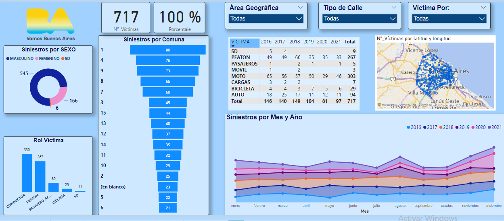

# Siniestros Viales Ciudad de Buenos Aires #

# Contenido

* [Introducción](#Introducción)

* [Propuesta](#Propuesta)

* [Conjunto de datos](#Conjunto-de-datos)

* [Tecnologías Utilizadas](#Tecnologías-Utilizadas)

* [Análisis Exploratorio de los Registros Hechos y Víctimas](#Análisis-Exploratorio-de-los-Registros-Hechos-y-Víctimas)

* [Recursos](#Recursos)

* [Créditos](#Créditos)

# Introducción

El Observatorio de Movilidad y Seguridad Vial (OMSV) que se encuentra ubicado en la Ciudad de Buenos Aires(CABA), nos solicita la elaboración de un *informe de analisís de Siniestros viales*  con el fin de generar un plan estratégico que permita a las autoridades locales y gubernamentales tomar acción para lograr un disminución en la cantidad de siniestros viales en esta importante ciudad capital.Para ello, nos proporcionó un registro de datos sobre siniestros viales comprendido entre los años 2016 y 2021, que cuenta con un registro detallado de  víctimas y hechos.

En el presente proyecto se desenglosará de manera explicativa y objectiva lo observado en el registro de datos.

# Propuesta

## Limpieza y Preparación de Datos

* Detección y Tratamiento de Valores Faltantes, Outliers y Registros Duplicados: Se realizará una búsqueda exhaustiva de valores faltantes, outliers y registros duplicados en el conjunto de datos. Se aplicarán técnicas adecuadas para el tratamiento de estos casos, tales como la eliminación de registros incompletos y la imputación de valores faltantes, garantizando la integridad y calidad de los datos.
* Verificación de Consistencia y Validez de los Datos: Se comprobará la consistencia y validez de los datos, asegurando que los valores estén dentro de rangos razonables y no presenten incoherencias.

## Análisis Descriptivo

* **Medidas de Resumen para Variables Numéricas:** Se calcularán medidas descriptivas como la media, mediana, moda, desviación estándar, rango y cuartiles para describir y resumir las características de las variables numéricas. Estas métricas proporcionarán una comprensión profunda de la distribución y variabilidad de los datos.
* **Análisis de Variables Categóricas:** Para las variables categóricas, se calcularán frecuencias y porcentajes.
* **Visualización de Datos:** Se elaborarán gráficos y tablas para visualizar la distribución de las variables y las relaciones entre ellas. Se utilizarán histogramas, gráficos de barras, para facilitar la interpretación y comunicación de los datos de manera efectiva.

## Conclusiones y Recomendaciones

* **Síntesis de Hallazgos del Análisis Descriptivo:** Se resumirán los hallazgos más relevantes del análisis exploratorio de datos (EDA), destacando las características principales del conjunto de datos, los patrones identificados y cualquier anomalía o tendencia significativa detectada.
* **Formulación de Recomendaciones:** Basado en los resultados obtenidos, se formularán recomendaciones para el tratamiento posterior de los datos. Esto puede incluir la transformación de variables, la selección de subconjuntos de datos específicos o la aplicación de técnicas de reducción de dimensionalidad para mejorar la eficiencia y efectividad de los modelos analíticos futuros.

# Conjunto de datos

El conjunto de datos proporcionado para este estudio está contenido en dos archivos Excel,el primero [homicidios](Datasets/homicidios.xlsx),y el segundo [Diccionario](Datasets/Diccionario-de-datos-Siniestros-viales.xlsx). Estos archivos está estructurados cada uno en dos hojas.
### HECHOS:
* **Descripción:** Esta hoja contiene datos relacionados con los hechos de homicidios.
* **Columnas:** 21, compuestas por una mezcla de datos cualitativos (nominales y categóricos) y datos numéricos.
* **Registros:** 696 registros en total.
* **Información Adicional:** La hoja incluye variables como fecha del evento, ubicación, tipo de vehículo siniestrado, entre otras.

### VICTIMAS:
* **Descripción:** Esta hoja contiene datos específicos sobre las víctimas de los siniestros.
* **Columnas:** 10, incluyendo variables como edad, género, rol de la víctima y año del siniestro, entre otras.
* **Registros:** 717 registros en total.

### DICCIONARIO_HECHOS:
* **Descripción:** Es una hoja informativa que proporciona descripciones detalladas de las 21 variables presentes en la hoja HECHOS.
* **Uso:** Facilita la comprensión de los datos contenidos en la hoja HECHOS, explicando el significado de cada columna y el tipo de datos que contienen.

### DICCIONARIO_VICTIMAS:
* **Descripción:** Similar a la hoja DICCIONARIO_HECHOS, esta hoja ofrece una descripción detallada de las 10 variables presentes en la hoja VICTIMAS.
* **Uso:** Es una herramienta clave para comprender la naturaleza y el propósito de cada columna en la hoja VICTIMAS, asegurando una interpretación precisa de los datos.
Este archivo Excel es una valiosa fuente de información para el análisis detallado de los hechos de siniestros y las características de las víctimas, proporcionando un marco claro y estructurado para la exploración y el análisis de datos.

# Tecnologías Utilizadas

Este proyecto hace uso de diversas tecnologías y herramientas para realizar un análisis exhaustivo de los siniestros viales en la Ciudad de Buenos Aires. Algunas de las principales tecnologías utilizadas incluyen:

- Ambiente de Desarrollo 

 

- Desarrollo del Dashboard 

# Análisis Exploratorio de los Registros Hechos y Víctimas 

A través de este proceso de Análisis Exploratorio de Datos (EDA), obtendremos una visión integral de la estructura de los datos, evaluaremos su calidad y analizaremos las relaciones entre las variables. Este conocimiento será fundamental para guiar las etapas posteriores del análisis, que abarcan desde la limpieza y preparación de los datos hasta la construcción de modelos y la toma de decisiones informadas.

En el primer análisis se observó la cantidad de víctimas que hay por Tipo de Ubicación y Tipo de Calle.

De la primera gráfica(izquierda) podemos extraer que la mayor cantidad de accidentes ocurren en en las intercepciones(donde se unen dos avenidas, se une una calle y una avenidad,etc), lo cual no es de extrañar porque en estos puntos entran varios conocimientos en juego, como podría ser la señalización, un punto siego, el doblar la esquina...

Se puede observar en la segunda gráfica(derecha) que la mayor parte de los siniestros ocurren en las avenidas yá que esta es una vía muy importante porque es la comunicación de la ciudad con el asentamiento urbano, es decir, es la arteria, sí o sí para llegar a otros lugares te vez obligado a transitar por allí.La otra cantidad de siniestros importantes las aporta las calles que es donde interactuan los automoviles y las personas, ya que las calles pertenecen a los barrios.

Como conclusión y en comparación con las calles,el foco y todas las enérgias gubernamentales se tienen que concentrar en disminuir la alta accidentalidad en las avenidas,tomando como primera medida disminuir su velocidad yá que como se pudo observar en el *Plan de Seguridad Vial de la Ciudad 2016-2019* el 80% de víctimas fatales ocurren con una velocidad asociada a los 60 km/h  y disminuye a la mitad solo mermando la velocidad a 45 km/h.

En la siguiente gráfica se analizó la cantidad de víctimas por accidente.

Se puede observar que en la mayoria de siniestros se tiene como registro 1 víctima y muy rara vez hay dos o más víctimas, esta razón quedará mejor entendida con la siguiente gráfica,donde también se observará la distribución de víctimas por sexo y su rol.

Con esta gráfica podemos ver la que mayoria de víctimas son los conductores ya que son los que reciben en muchas ocasiones el impacto directo y los peatones ¿por qué los peatones? las autoridades tendran que poner especial atentión en el comportamiento de los peatones  en las calles y avenidas, ya que en muchos casos estos no respetan las normas de tránsito y se arriesgan a cruzar en lugares no permitidos. La cantidad de víctimas femeninas es menor que la cantidad de víctimas masculinas, lo que puede ser debido a que los hombres son los que más manejan vehículos y se exponen más a riesgos.

Ahora analizaremos la cantidad de siniestros por año.

Podemos ver una disminución de víctimas fatales para los años 2019 hasta el 2021 que si analizamos profundamente no es significativo porque en este lapso de tiempo se vivió la pandemia mundial y se hubiera esperado una disminuición sustancial en víctimas de accidentes viales, incluso se observa que para el año 2021 empezó a haber un incremento, lo cual nos diría que la gente empezó a salir más y retomar una vida normal como la que se vivia antes de pandemia.

A continuación se observará la cantidad de fallecidos por día de la semana, para lograr esta gráfica se agrupo por día  y se filtro por todos los años el número de víctimas.

Se puede observar que los días pico de siniestralidad van desde el día viernes hasta el lunes, no es de extrañar ya que normalmente son los días de más actividad social, y que este implicado el lunes indica que se viene de un fin de semana que muchas veces se le prolonga a las personas hasta este día.

Una imagen importante de resaltar es la cantidad de siniestros por comuna, ya que allí se podrán presentar estrategias especiales.

Se puede observar que las comunas más grandes en las coordenadas suroeste cercanas al puerto son las que más víctimas presentan, como son la comuna 1 y comuna 4.La comuna 8 y 9 que son las que siguen en porcentaje tienen una avenida, la comuna 9 a la av.General Paz y la comuna 8 la av.27 de Febrero, lo cual concuerda con la tasa alta de siniestralidad presentada en las avenidas, ya que, las demás comunas que le siguen en porcentaje también son lindadas por avenidas, el único caso extraño sería la comuna 3 que es la más pequeña y con menos barrios, pero se puede observar que está en medio de las comunas 1 y 4, seria valido afirmar que esta es un punto obligado para quienes quieran o necesiten salir o entrar de la comuna 1.

En la siguiente imagen analizaremos una tabla cruzada, con ACUSADO(representado por el tipo de vehículo)y VÍCTIMA(representado por el vehículo que lo afecto).

Se puede observar que la mayoría de los siniestros son causados por vehículos particulares que afectan mayormente a motociclistas y peatones, estos siniestros pueden ser causados por, la imprudencia tanto de motociclistas como de peatones en las vías al no respetar las señales de transito, ir a velocidades muy altas, hacer cruces por canales no dispuestos para los peatones, también la intolerancia del conductor del vehículo con los demás participantes de las vías. Se puede observa también la columna *PASAJEROS* con una impresionante tasa alta en la causa de víctimas fatales *PEATÓN*,sin embargo, pudo haber un error a la hora de tomar los datos, o los pasajeros tienen una incidencia indirecta sobre el conductor, ya que, puedieron incitar a una desconcentración de este mientras,se estaba  al mando del vehículo.

La otra cantidad importante a observar la aportan los vehículos de carga, causando mayor afectación a los motociclistas, seguido por los peatones, los autos y bicicletas; este tipo de autos tienen que estar bajo el mando de personas responsables, con conicimiento de la ley,con un buen dominio y pericia en este tipo de automotores.

Como víctimas los que aportan la mayor cantidad son las motos, seguidos por los peatones, esto es facíl de explicar ya que, el parque automotor de vehículos tipo moto ha ido creciendo en los últimos años un 30%
fuente el Clarin.com
, en una moto tu eres el chasis del vehículo, ir en dos ruedas no aporta tanta estabilidad como ir en un automóvil, entonces, exceder la velocidad en este tipo de automotores, la mayor parte del tiempo resulta en un siniestro.También el hecho de que la mayor parte de las víctimas las aporten los peatones es de especial cuidado, al peatón hay que enseñarle que él puede resultar ser el más afectado ante una imprudencia en las calles, ya que, su cuerpo es su vehículo de desplazamiento y por tanto el que resulta afectado ante una imprudencia.

Como otro punto a observar de esta gráfica, las autoridades deben poner su atención en hacer campaña de concientización a los pasajeros, porque pudimos observar su alta incidencia en la causa de siniestros,estos son los que menos consecuencias como víctimas sufren, pero aportan una gran cantidad de víctimas.

Por último, pero no menos importante, analizaremos las gráficas de la distribución de edad y la proporción de víctimas por sexo.

Se puede observar que la mayoría de las víctimas son hombres entre los 20 y 40 años.Esta población será de gran importacia a la hora de generar una campaña de concientización y un objetivo por parte de las entidades gubernamentales.

Por último, se pone un pantallazo del dashboard, una herramienta clara y eficaz para hacer un análisis profundo e interactivo de lo tratado en este readme.

La seguridad vial es cuestión de todos, para que un plan de seguridad vial o una estrategia tenga éxito necesita de voluntad política y del compromiso de todos los actores que participan en la movilidad.

### Los pricipales actores que se deben involucrar son: ###

### Los ejes fundamentales deben ser: ###
* Infraestructura segura
* Control y legislación 
* Educación y conciencia
* Investigación y seguimiento
* Atención a víctimas y familiares

# Recursos

* [Plan de Seguridad Vial de la Ciudad 2016-2019](https://buenosaires.gob.ar/plan-de-seguridad-vial-de-la-ciudad-2016-2019)

# Créditos

Copyright (c) 2024 [Ing. Nathaly Castro] artesana160189@gmail.com

 

